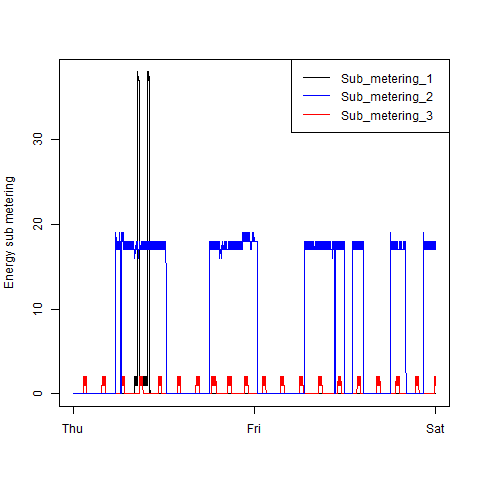
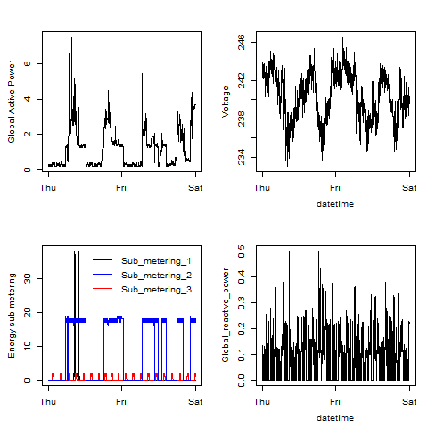

# Exploratory Data Analysis Assignment

## Packages

library(dplyr)

library(lubridate)

## Input data

Data taken from "./data/household_power_consumption.txt". This dataset contains
data on power consumption in one household with a one minute sampling rate over 
a period of almost 4 years. Different electrical quantities and some sub-metering
values are available. For more information on the 9 variables used see:

https://archive.ics.uci.edu/ml/datasets/Individual+household+electric+power+consumption

## Data Processing

1. Data is read in from "./data/household_power_consumption.txt"
2. The "Date" and "Time" column are combined into a single Datetime column in
the datetime format
3. A subset of the raw data is extracted across the days 01/02/2007 - 02/02/2007
4. Relevant data is converted to numeric format
5. Plots generated (see "Outputs")

## Outputs

### Plot 1

 

### Plot 2

 

### Plot 3

 

### Plot 4

 

